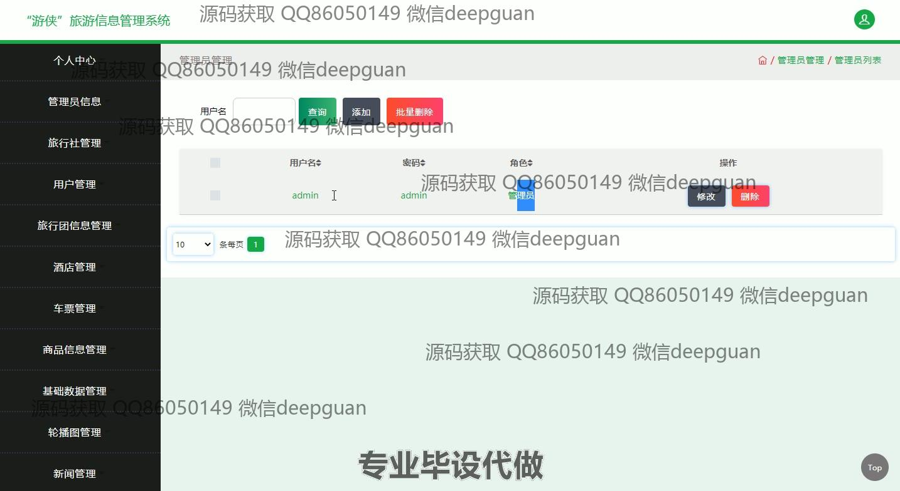

<h1 align="center">基于的“游侠”旅游信息管理系统</h1>

## 简介
游侠旅游信息管理系统：角色分为管理员、用户；提供行程管理、票务查询、酒店预订、旅游团信息管理、用户信息编辑、新闻和商品管理等功能，界面简洁，用户体验友好。    --计算机毕业设计源码；毕设源码；java毕业设计源码

## 联系方式

<h3 align="center">获取完整代码与数据库文件 + 微信：deepguan QQ: 86050149 QQ群: 783742310</h3>

<h3 align="center">可帮忙远程部署 包运行成功！提供远程部署、修改代码、设计文档指导、代码讲解等服务！</h3>

## 功能介绍（完整见运行截图）
管理员：管理员可以访问旅游信息管理系统的核心模块，包括旅行社、用户、旅行团、酒店、车票以及商品信息管理。能够进行用户信息的录入与验证，管理新闻内容，查询、添加、修改和删除各类信息，维护系统数据的准确性与安全性。可进行分页操作以便于管理大量数据，查看并处理酒店的留言回复。

用户：用户可以通过个人中心界面管理个人信息和账户，包括修改姓名、性别、身份证号和手机号，上传头像并查询账户余额。用户可以通过网站导航访问车票订单、酒店订单和旅行团订单，查看订单详情。系统提供简洁易用的旅游行程、酒店预订和消息浏览功能，提高用户的交互体验。

游客：游客可通过主导航栏浏览首页、车票、酒店、旅行团信息和新闻模块，访问各类旅游资讯。页面设计简洁，提供基础的票务查询和预定功能，同时能预览旅行相关图片并设置旅行时段。游客可以自由浏览系统提供的商品信息和公告。

开发者：开发者在系统中实现了动态加载动画和广告水印，采用SSM框架，保障系统功能的稳定性与运行效率。使用日历组件辅助酒店预订，规范各项输入数据格式，支持批量操作和数据分页展示，优化用户操作与管理流程。

## 运行截图

本代码来源于网络,仅供学习参考使用!

